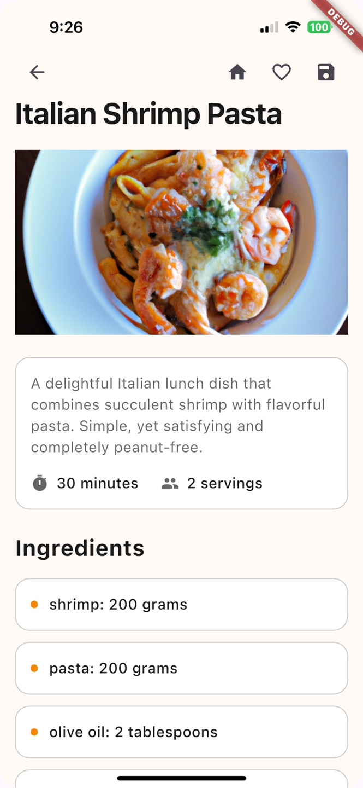
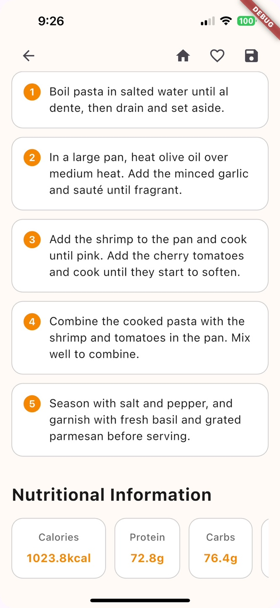

# 🍳 MakeEat - AI-Powered Recipe Generator

<div align="center">
  <p><em>Transform your ingredients into delicious meals with AI-powered recipe generation</em></p>

  <!-- Add badges here -->
  <p>
    
    
    
  </p>
</div>

## 🌟 Overview

MakeEat is an innovative mobile application that revolutionizes home cooking by combining AI-powered recipe generation with practical features. The app creates personalized recipes based on your available ingredients while considering dietary preferences and restrictions.

## ✨ Key Features

- 🤖 **Smart Recipe Generation**: Leverages OpenAI's GPT for personalized recipe creation
- 📸 **Receipt Scanner**: Advanced OCR technology for ingredient extraction
- 🎨 **Intuitive UI**: Custom-designed gradient interfaces with DM Sans typography
- 🔄 **Real-time Updates**: Seamless Firebase integration
- 📱 **Cross-platform**: iOS and Android compatibility
- 💾 **Offline Support**: Local recipe storage

## 🏗️ Architecture

```
lib/
├── screens/              # UI Screens
│   ├── auth/            # Authentication screens
│   ├── onboarding/      # User onboarding flow
│   └── recipe/          # Recipe-related screens
├── services/            # Business Logic
│   ├── api/            # API integrations
│   ├── auth/           # Authentication services
│   └── storage/        # Local storage handling
├── models/             # Data Models
├── widgets/            # Reusable Components
└── utils/              # Helper Functions
```

### Design Patterns
- **MVVM Architecture**
- **Repository Pattern** for data management
- **Service Locator** for dependency injection
- **Observer Pattern** for state management

## 🛠️ Technical Stack

### Frontend
- **Framework**: Flutter 3.0+ with Dart
- **State Management**: Provider 6.1.2
- **UI Components**: Material Design
- **Image Processing**: Image Gallery Saver

### Backend & Services
- **Authentication**: Firebase Auth 5.3.3
- **Database**: Cloud Firestore 5.5.0
- **API Integration**: OpenAI GPT
- **Storage**: SharedPreferences

## 📱 Screenshots & Demo

<div align="center">
  <table>
    <tr>
      <td></td>
      <td></td>
    </tr>
  </table>
  
  <h4>App Demo</h4>
  <a href="assets/screenshots/screenrecord.mp4">Watch Demo Video</a>
</div>

## 🚀 Getting Started

1. **Clone the repository**  
   ```bash
   git clone https://github.com/MakeEat/frontend.git
   ```

2. **Install dependencies**
   ```bash
   flutter pub get
   ```

3. **Configure environment variables**
   ```bash
   cp .env.example .env
   ```
   Required variables:
   ```
   OPENAI_API_KEY=your_openai_api_key
   FIREBASE_CONFIG=your_firebase_config
   FATSECRET_API_KEY=your_fatsecret_api_key
   ```

4. **Run the app**
   ```bash
   flutter run
   ```

## 🔐 Security Features

- Secure API key management
- Firebase Authentication
- Permission handling
- Data encryption

## 🧪 Testing

```bash
# Run unit tests
flutter test

# Run integration tests
flutter test integration_test
```

## 📈 Performance Optimization

- Lazy loading for images
- Caching mechanisms
- Efficient state management
- Optimized API calls

## 🤝 Contributing

We welcome contributions! Please see our [Contributing Guidelines](CONTRIBUTING.md) for details.

## 📄 License

This project is licensed under the MIT License - see the [LICENSE](LICENSE) file for details.

## 🙏 Acknowledgments

- OpenAI for the GPT API
- FatSecret for nutritional data
- Flutter team for the amazing framework

---
<div align="center">
  <p>Developed with 💡 by Anu</p>
  <p>
    <a href="https://github.com/yourusername">
      
    </a>
  </p>
</div>
